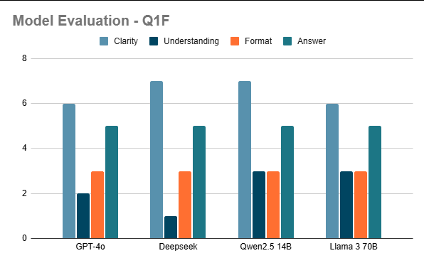
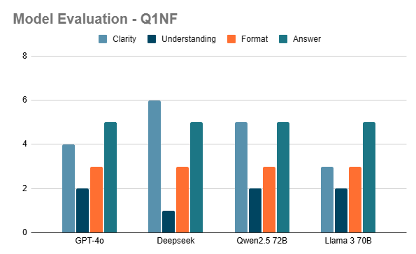
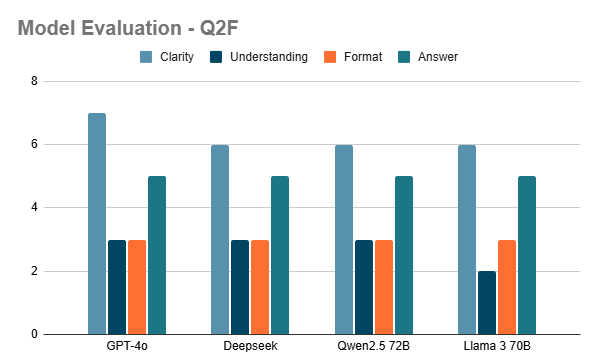
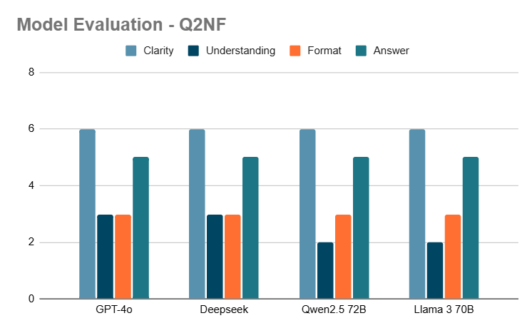
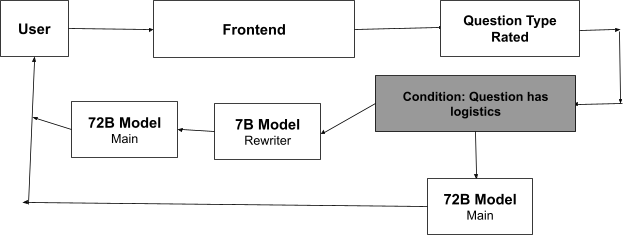

# Effect of Prompt Phrasing on LLMs: Qwen2.5, GPT-4o, DeepSeek, Llama

Dylan Santwani · February 2025 · [PDF](effect-of-prompt-phrasing-on-llms.pdf) · [Web](https://dylansantwani.github.io/prompt-phrasing/)

## Abstract

Many open models, such as Qwen2.5, Llama and DeepSeek (R1), as well as GPT-4o and close clones of GPT-2, are trained on data drawn largely from the internet. A large part of that data is textbook-like questions, most of them in SAT style. Those questions follow formatting guidelines that make them easier for a test-taker to read and understand. Models tend to be more accurate when a prompt resembles their training data, so I speculated that phrasing a prompt like a textbook question would produce more accurate results with clearer answers.

If that holds, a small model (3B or 7B) placed between the user and the main LLM could rewrite prompts into that form and improve the results.

## Method

Each model received the question as an image, preceded by this system prompt:

> Explain your thoughts in solving this question. Solve it in 5 steps, and explain each step. Make your ending answer clear.

No answer choices were given to any model. Each question was asked twice: once in its original SAT format and once rewritten without formatting (the rewrite was produced with Gemini). I hand-scored every answer:

| Category | Points | Awarded for |
|---|---|---|
| Clarity | 7 | How clear each step is |
| Understanding | 3 | Understanding what the question asks for and how to get there |
| Format | 3 | Giving the answer in a form that matches one of the (hidden) answer choices |
| Answer | 5 | Correct (5) or incorrect (0) |

Question 1 is an algebra word problem that tests logical reasoning, algebra and real-world problem solving. Question 2 is a reading question that tests comprehension, vocabulary in context and inference.

## Results

Scores out of 18 ([scores.csv](scores.csv)):

| Model | Q1 formatted | Q1 unformatted | Q2 formatted | Q2 unformatted |
|---|---|---|---|---|
| GPT-4o | 16 | 14 | 18 | 17 |
| DeepSeek | 16 | 15 | 17 | 17 |
| Qwen2.5 | 18 | 15 | 17 | 16 |
| Llama 3 70B | 17 | 13 | 16 | 16 |
| Mean | 16.75 | 14.25 | 17.0 | 16.5 |

Every model answered both questions correctly in both versions. The differences are in how the answer was reached.

On Question 1 (algebra), every model's clarity dropped without the formatting, and the mean fell by 2.5 points. Llama 3 lost the most, 7 to 3 on clarity. Formatting the question the way the training data does made a clear difference.

On Question 2 (reading), the formatting barely mattered: the mean fell by 0.5 points, from one-point drops in GPT-4o's clarity and Qwen2.5's understanding. The loss of understanding likely comes from the rewrite slightly changing the question's meaning.

| Q1 formatted | Q1 unformatted |
|---|---|
|  |  |

| Q2 formatted | Q2 unformatted |
|---|---|
|  |  |

## Conclusion

These models perform noticeably differently when a question involves logical reasoning, like basic algebra. Rephrasing such a question into the common textbook format that fits the training data could produce better results. Reading-comprehension questions are much less sensitive to formatting.

Application: classify each incoming prompt by whether it involves logical reasoning. If it does, have a small model (7B) rewrite it into textbook form, then send it to the main model (72B).



This fits the view in *Large Language Models: A Survey* (Minaee et al., 2024) that many LLM shortcomings, hallucination included, can be addressed with better prompt engineering. Rewriting prompts this way might also reduce hallucinations.

## Limitations

This is a small independent study: two questions, four models, one scorer. The scores are hand-assigned, so treat them as directional, not statistically significant. The original PDF describes the rubric as out of 15, but its four categories add up to 18, which is the scale used above. In the Q1 formatted chart Qwen2.5 is labeled 14B, and 72B elsewhere.

## Cite

```bibtex
@misc{santwani2025promptphrasing,
  author = {Santwani, Dylan},
  title  = {Effect of Prompt Phrasing on LLMs: Qwen2.5, GPT-4o, DeepSeek, Llama},
  year   = {2025},
  month  = feb,
  url    = {https://github.com/dylansantwani/prompt-phrasing-llms}
}
```
